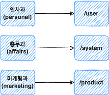
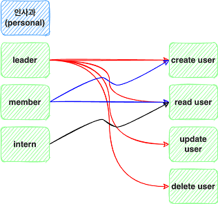
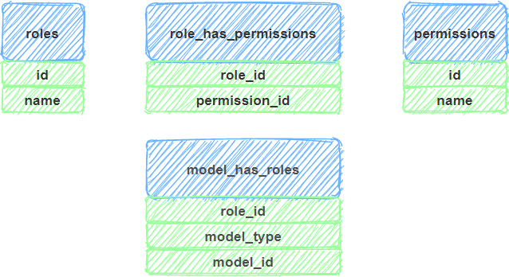
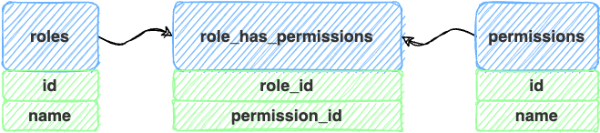
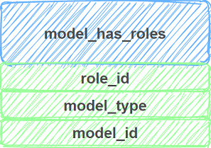
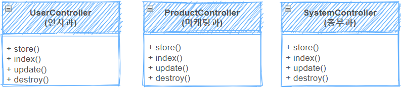
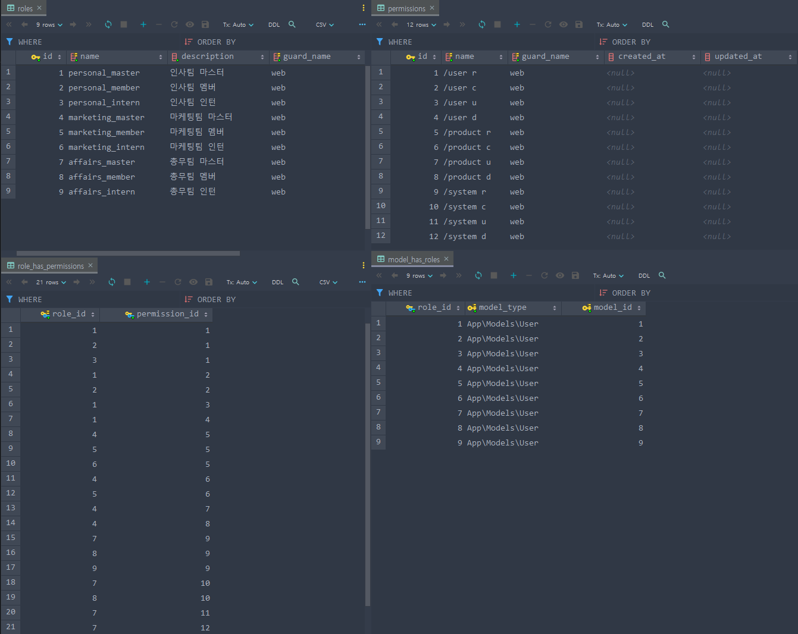
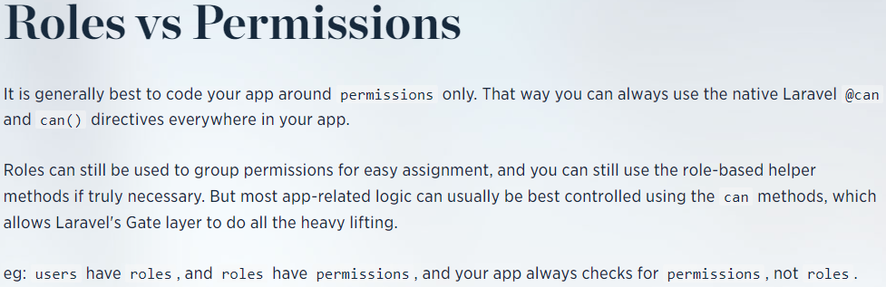

https://spatie.be/docs/laravel-permission/v5/introduction
## 1. 설계
### 1-1. 첫번째 ACL 분류


1. `인사과`은 `/user`에만 접근할수 있고,
2. `총무과`는 `/system`,
3. `마케팅과`는 `/product`에만 접속할 수 있습니다.

### 1-2. 두번째 ACL 세분화 분류
역할(`role`)과 접근권한(`permission`)으로 좀 더 세분화를 해보겠습니다.



각 부서는 3가지의 권한이 있는데
1. `leader`는 `CRUD`,
2. `member`는 `CR`,
3. `intern`은 `R`만 가능합니다.

즉, 유저가 **권한이 없을 때는**, **해당 접근이 불가능**하게 해야 합니다.
### 1-3. table 관계도


#### 1-3-1 role, permission
`leader, member, intern`은 `role`이고, `CRUD`에 관한건 `permission`입니다.

1개의 `role`은 다수의 `permission`을 가질 수 있고, 1개의 `permission`또한 다수의 `role`을 가질 수 있기 때문에 
중간에 `role_has_permission` 테이블을 놓아서 `다대다 관계`를 형성하고 있습니다.


#### 1-3-2 model has roles
각 유저가 어떤 역할을 가지고 있는지는 `model_has_roles table`로 관리합니다.
이렇게 함으로써, 기존 `users table`에 `column`을 추가할 필요없이 적용이 가능합니다.



## 2-laravel-pemission 설정
### 2-1. 설치
`composer require spatie/laravel-permission`
### 2-2. 프로바이더 설정
선택사항입니다. 아래 providers 배열에 추가하지 않아도 자동으로 연결되지만,

현재 설치되어있는 패키지들을 명시적으로 표현해주고 싶어서 작성했습니다.
```php
// config/app.php
'providers' => [
    // ...
    Spatie\Permission\PermissionServiceProvider::class,
];
```
### 2-3. 마이그레이션 파일 가져오기
새로운 테이블들을 생성하기 위한 마이그레이션 파일들을 로컬로 가져옵니다.

`php artisan vendor:publish --provider="Spatie\Permission\PermissionServiceProvider"`

그러면 `config/permission.php`파일을 볼 수 있는데, 여기서 각 테이블에 대한 설정을 변경할 수 있습니다.
### 2-4. laravel-permission 테이블 생성
`php artisan migrate`
`config/permission.php`를 토대로 `table`들이 생성됩니다.
1. roles
2. permissions
3. role_has_permissions
4. model_has_roles
5. model_has_permissions(여기에선 다루지 않습니다.)

## 3. 로직 작성


각 컨트롤러에 `CRUD`관련 `function`이 정의되어 있습니다.

각각의 `role`에 따라 `function`들의 접근을 막아야 합니다.

### 3-1. laravel-permission table 값들

현재 `laravel-permission`관련 `table`들의 값들입니다.
1. `roles`테이블에는 각 부서당 3가지의 `role`이 있고, 총 9개의 `role`이 있습니다.
2. `permissions` 테이블에는 현재 정의되어있는 기능들에 대한 `permission`이 있습니다.
3. `role_has_permissions`테이블에는 각 `roles`와 `permissions`를 연결해 주는 값들이 있습니다.
4. `model_has_roles`테이블에는 각 `user`가 가지고 있는 `role`을 정해주고 있습니다.

### 3-2 구현
`인사과`와 관련있는 1개만 예를 들겠습니다.(나머지 과도 다 똑같습니다.)

`web.php`에서 각 `route`에 `middleware`를 적용할 수도 있지만, 

만약 기존 `route`가 `resource`로 되어있을 경우, 변경하기가 힘들어서

`Controller`내부의 `constructor`에서 `middleware`를 적용하였습니다.
```php 
class UserController extends Controller
{
    public function __construct()
    {
        $this->middleware('permission:/user r,web', ['only' => ['index']]);
        $this->middleware('permission:/user c,web', ['only' => ['store']]);
        $this->middleware('permission:/user u,web', ['only' => ['update']]);
        $this->middleware('permission:/user d,web', ['only' => ['destroy']]);
    }
```
각 `role`에 대한 `middleware`를 지정한 것이 아닌, `permission`에 대한 `middlware`를 지정한 것이 보입니다.

`permission`이 아닌 `role`에 집중을 하게 되면, 접근제한을 원활하게 할 수 없게됩니다. 위 공식문서에서도 `permission`으로 접근제한을 두라 말하고 있습니다.

https://spatie.be/docs/laravel-permission/v5/best-practices/roles-vs-permissions


`permission middleware`를 사용하기 위해 `Kernel.php`의 `$routeMiddleware`에 `permission`을 추가합니다.
```php
protected $routeMiddleware = [
        ...
        'permission' => \Spatie\Permission\Middlewares\PermissionMiddleware::class,
    ];
```
### 3-3 테스트 코드 작성
auth가 구현되어 있지 않은 관계로 테스트코드를 작성하여 테스트했습니다.
```php
<?php
namespace Tests\Feature;

use App\Models\User;
use Illuminate\Foundation\Testing\RefreshDatabase;
use Illuminate\Foundation\Testing\WithFaker;
use Spatie\Permission\Models\Role;
use Tests\TestCase;

class PermissionTest extends TestCase
{
    public function masterDataProvider() {
        return array(
            array("personal_master","/user"),
            array("marketing_master","/product"),
            array("affairs_master","/system"),
        );
    }

    public function memberDataProvider() {
        return array(
            array("personal_member","/user"),
            array("marketing_member","/product"),
            array("affairs_member","/system"),
        );
    }

    public function internDataProvider() {
        return array(
            array("personal_intern","/user"),
            array("marketing_intern","/product"),
            array("affairs_intern","/system"),
        );
    }

    private function getUser($role)
    {
        $user = User::whereHas('roles', function($query) use($role){
            return $query->where('name', $role);
        })->with('roles')->first();
        $this->actingAs($user);
    }


    /**
     * @dataProvider masterDataProvider
     */
    public function test_role_master($role, $route)
    {
        $this->getUser($role);

        $this->get($route)->assertOk();
        $this->post($route)->assertOk();
        $this->patch($route.'/1')->assertOk();
        $this->delete($route.'/1')->assertOk();
    }

    /**
     * @dataProvider memberDataProvider
     */
    public function test_role_member($role, $route)
    {
        $this->getUser($role);

        $this->get($route)->assertOk();
        $this->post($route)->assertOk();
        $this->patch($route.'/1')->assertStatus(403);
        $this->delete($route.'/1')->assertStatus(403);
    }

    /**
     * @dataProvider internDataProvider
     */
    public function test_role_intern($role, $route)
    {
        $this->getUser($role);

        $this->get($route)->assertOk();
        $this->post($route)->assertStatus(403);
        $this->patch($route.'/1')->assertStatus(403);
        $this->delete($route.'/1')->assertStatus(403);
    }

}
```
## 4. 소스코드
https://github.com/kaelch/laravel8.git
1. `php artisan db:seed`
테이블 시딩
2. `php artisan test`
테스트
